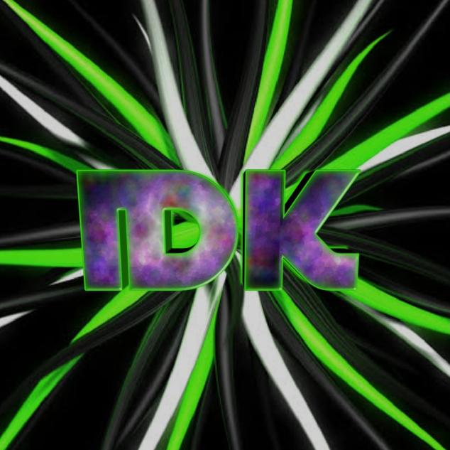

# **Chronium Bot**

Description

 
> Chronium bot is a group of bots which are made for helping you in you're discord server and they are the highest quality bots made by **[iRed](https://github.com/iRed-Github)** and her team.

---
## Github Stats

Click to view

 

 

  
 
 
 

 
 

---
## Support me!

Click here to support me

> You can always support me by any of the following thing!
1. **`Invite my bots`**

| Name | Features | Click in this place to invite them |
| - | - | - |
| Chronium Bot | This is an advanced discord multi-purpose bot built to manage you're discord servers |  |
| Chronium Music | This is an advanced discord music bot built to give you the best music experience |  |

2. **`Join my discord server`**

 
3. **`Follow me on github`**
- [iRed](https://github.com/iRed-Github)
- [Me](https://github.com/Chronium-Bots)

 
4. **`Star this repo`**

